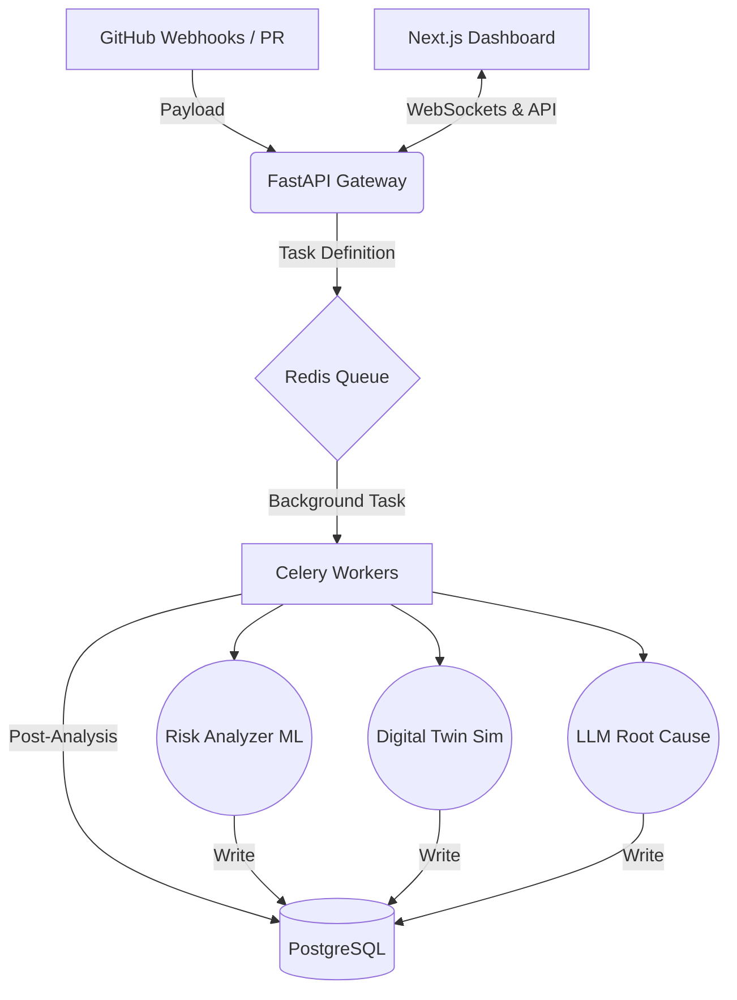

# 🏗️ SentinelOps Architecture & Technical Deep Dive

SentinelOps is built as a sophisticated, asynchronous AI co-pilot meant to integrate invisibly into developer workflows. We separate the presentation layer from the heavy, background AI risk analysis. 

---

## 🌐 1. High-Level System Design

### The Data Flow
1. **Ingestion**: The user registers a repository. A webhook is created. SentinelOps listens for `pull_request` and `push` events.
2. **Buffering**: FastAPI instantly acknowledges GitHub (`200 OK`) and pushes the event payload into a **Redis message broker**.
3. **Execution**: **Celery workers** constantly poll Redis. When a job arrives, they parallelize the execution:
   - Run Monte Carlo simulations to calculate system stress.
   - Vectorize the incoming PR diffs to find structurally similar past failures.
   - Run a Logistic Regression model trained on historical failure data to calculate an immediate "Risk Score".
4. **Action**: Depending on the risk score, the Gatekeeper agent pushes a Commit Status directly back to GitHub's UI (`success` or `failure`).
5. **Observation**: The data is persisted in **PostgreSQL**. The Next.js dashboard visualizes the Risk Heatmap and allows querying the LLM for plain-english explanations of the failed PRs.

---

## 🧠 2. The AI & Machine Learning Pipeline

### a) Multi-Dimensional Risk Modeling
We don't just rely on an LLM for everything. We use classical ML where it works best. We extract features from a Pull Request:
- Code churn (lines added/deleted)
- Number of files touched
- Extension volatility (e.g., changes to `.yml` vs `.md`)
- Commit history of the author

These features are fed into a **Logistic Regression** model (implemented via `scikit-learn`) to predict the probability, between 0% and 100%, that this code will break production. 

### b) The "Digital Twin" Deployment Simulation
Prioritize risk through chaos engineering:
- The system runs 1,000 randomized Monte Carlo simulations against the PR's perceived complexity and historical server metrics.
- Output: A statistical likelihood of CPU/Memory thresholds breaching under load if this PR is merged.

### c) LLM Root Cause Explanation
If a CI/CD pipeline fails, the stdout/stderr logs are often massive.
- The Celery worker truncates and sanitizes the logs.
- The compressed payload is sent to **GPT-4o**.
- GPT-4o streams a response containing a natural language explanation, the likely culprit line of code, and a suggested patch diff.

### d) Vector Similarity Search
We convert every historical failure into an embedding (an array of numbers representing semantic meaning).
When a new incident occurs, we embed it and run a cosine similarity search against the DB. This allows SentinelOps to say: *"This failure looks 96% similar to an incident from 3 weeks ago related to a Redis memory leak."*

---

## 📦 3. Tech Stack Justification

| Technology | Purpose | Why We Chose It |
| :--- | :--- | :--- |
| **Next.js 14** | Dashboard & UI | React Framework that handles real-time updates and fast client-side rendering seamlessly. |
| **Tailwind CSS + Framer** | Styling & Animations | Allows rapid prototyping of complex, beautiful user interfaces without dealing with dense CSS files. |
| **FastAPI** | Core Backend | Extremely fast, built-in async support, automatic OpenAPI (Swagger) documentation. |
| **Celery + Redis** | Task Queue | Machine Learning operations are slow. We cannot block HTTP requests. Celery handles heavy background tasks elegantly. |
| **PostgreSQL** | Primary Database | Relational integrity for Repositories, Commits, and Incidents. |
| **Docker** | Infrastructure | Ensures "it works on my machine" translates to the hackathon judges' machines immediately. |
